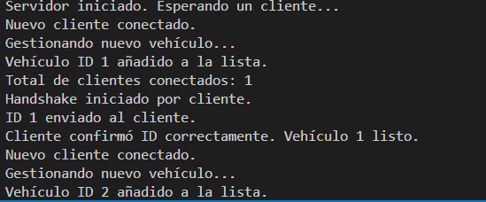

# Simulación de Tráfico - Proyecto Cliente Servidor

Este proyecto simula una carretera con un puente de un solo carril, donde varios vehículos (clientes) se conectan a un servidor. El servidor controla las conexiones, asigna identificadores y mantiene información sobre los vehículos conectados.

## Etapa 1: Conexión servidor - cliente

**Objetivo**: Establecer la conexión básica entre servidor y cliente.

- El servidor se inicia y espera un único cliente.
- El cliente se conecta y ambos muestran mensajes por consola.

## Etapa 2: Aceptación de múltiples clientes

**Objetivo**: El servidor debe aceptar múltiples clientes usando hilos.

- Cada cliente se gestiona en un hilo diferente.
- Se muestra por consola: "Gestionando nuevo vehículo..."

## Etapa 3: Asignar un ID único a cada vehículo

**Objetivo**: Cada cliente debe recibir un ID único asignado por el servidor.

- Se protege el contador con `lock`.
- Se asigna una dirección aleatoria: "Norte" o "Sur".

## Etapa 4: Obtener el NetworkStream

**Objetivo**: Obtener el stream de red en servidor y cliente.

- Se obtiene el `NetworkStream` tras la conexión.
- Aún no se transmite nada, solo se verifica que se puede usar.

## Etapa 5: Programar métodos de lectura y escritura

**Objetivo**: Crear métodos reutilizables para enviar/recibir mensajes por stream.

- `EscribirMensajeNetworkStream(NetworkStream, string)`
- `LeerMensajeNetworkStream(NetworkStream)`

**Clase `NetworkStreamClass` implementada con estos métodos.**

## Etapa 6: Handshake

**Objetivo**: Establecer comunicación previa a la ejecución del cliente.

- Cliente envía "INICIO"
- Servidor responde con el ID
- Cliente confirma recibiendo el ID

## Etapa 7: Almacenar información de clientes conectados

**Objetivo**: Mantener una lista de clientes activos con su ID y Stream.

- Se crea la clase `Cliente { int Id; NetworkStream Stream; }`
- Se almacena cada cliente nuevo en una lista protegida con `lock`.
- Se muestra la cantidad total de clientes conectados.

**Consola ejemplo:**

## Recomendaciones

- Asegúrate de ejecutar primero el servidor.
- Cada etapa puede probarse individualmente.
- La clase `NetworkStreamClass` permite reutilizar el código de comunicación.

**Autor**: Javier Cerejido Cortés  
**Asignatura**: ICB0009 - Programación de Servicios y Procesos

