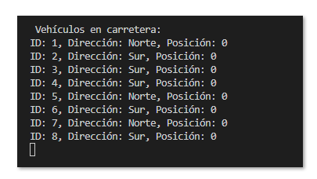
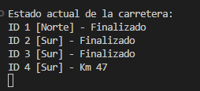
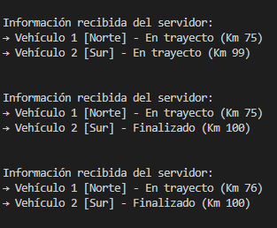

# Simulación de Tráfico – Ejercicio 2: Intercambio de Información entre Vehículos

Este proyecto simula una carretera con varios vehículos circulando desde el cliente hacia el servidor. Se ha implementado una arquitectura cliente-servidor donde cada cliente representa un vehículo que envía su posición al servidor, y este a su vez transmite el estado completo de la carretera a todos los clientes conectados.

---

## ⚙️ Tecnologías utilizadas

- .NET Core / C#
- Programación concurrente (`Thread`)
- Serialización XML
- Sockets TCP
- Streams (`NetworkStream`)
- Manejo de excepciones con `try-catch`

---

## Etapas del proyecto

### Etapa 0: Clases Vehículo y Carretera

- `Vehiculo`: contiene propiedades como `Id`, `Pos`, `Velocidad`, `Direccion`, `Parado`, `Acabado`.
- `Carretera`: mantiene la lista de vehículos activos y su estado en la carretera.

---

### Etapa 1: Programación de métodos en `NetworkStreamClass`

Se implementaron los siguientes métodos para gestionar los streams de forma eficiente:

```csharp
EscribirDatosVehiculoNS(NetworkStream NS, Vehiculo V)
LeerDatosVehiculoNS(NetworkStream NS)
EscribirDatosCarreteraNS(NetworkStream NS, Carretera C)
Carretera LeerDatosCarreteraNS(NetworkStream NS)
```

---

### Etapa 2: Crear y enviar un Vehículo

- El cliente crea un vehículo y lo envía al servidor al conectarse.
- El servidor lo recibe, le asigna un `Id` y lo añade a la carretera.

📸 **Capturas de pantalla**



---

### Etapa 3: Mover los vehículos

- El cliente avanza su vehículo con un `Thread.Sleep(vehiculo.Velocidad)`.
- En cada paso, se actualiza la posición y se envía al servidor.
- El servidor actualiza la lista y muestra la carretera.
- Al llegar a 100 km, el vehículo se marca como `Acabado`.

📸 **Capturas de pantalla**


---

### Etapa 4: Enviar carretera a todos los clientes

- Cada vez que el servidor recibe una actualización, la transmite a **todos** los clientes conectados mediante su `NetworkStream`.
- Se envía el objeto `Carretera` serializado junto a su longitud.

---

### Etapa 5: Recepción de información del servidor en los clientes

- Cada cliente lanza un hilo secundario que escucha permanentemente el servidor.
- Al recibir una actualización de la carretera, la deserializa y la muestra en pantalla.

> Se utiliza `try-catch` para evitar errores por desconexión o escritura inválida.

📸 **Capturas de pantalla**



---

## 🎯 Resultado esperado

Cada cliente puede ver el avance de todos los vehículos en tiempo real gracias a la retransmisión del servidor.

📸 **Capturas de pantalla**



---

**Autor**: Javier Cerejido Cortés  
**Asignatura**: ICB0009 - Programación de Servicios y Procesos