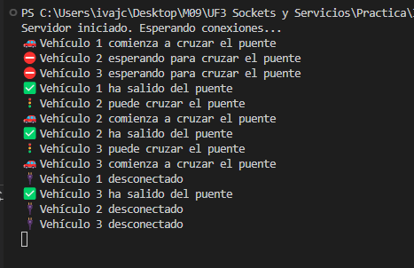
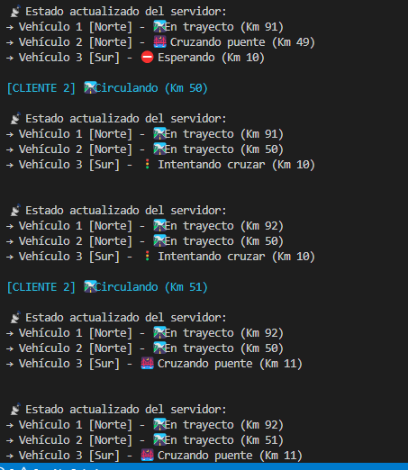

# 🚧 Ejercicio 3 – Simulación de Tráfico: Paso Único por el Puente

## 🎯 Objetivo del ejercicio

Simular una carretera donde **solo un vehículo puede cruzar el puente al mismo tiempo**, gestionando:
- La **sincronización del paso** por el puente.
- El **orden de entrada y salida**.
- La **visualización del estado** en consola desde cliente y servidor.

---

## 🔁 Flujo de ejemplo

```
1. Vehículo #1 (Norte) entra al puente
   → Servidor: vehiculoEnPuenteId = 1

2. Vehículo #2 (Norte) intenta entrar
   → Servidor: Esperando, puente ocupado

3. Vehículo #1 sale del puente
   → Servidor: vehiculoEnPuenteId = null

4. Vehículo #2 recibe permiso para cruzar
```

---

## ⚙️ Requisitos técnicos cumplidos

- ✅ Registro del vehículo en el puente desde el **servidor**.
- ✅ Control de concurrencia usando `SemaphoreSlim`.
- ✅ Cola de espera para vehículos en **función de su dirección**.
- ✅ Clientes actualizan y muestran el estado:  
  `"Esperando"`, `"Cruzando puente"`, `"En trayecto"`, `"Finalizado"`.
- ✅ Logs visuales y detallados en consola.

---

## ❓ Preguntas teóricas

### 1. ¿Dónde debe estar el control del túnel: en cliente o servidor?

| En Cliente               | En Servidor              |
|--------------------------|--------------------------|
| ❌ Dificultad de sincronización global | ✅ Control centralizado |
| ❌ Posibles inconsistencias | ✅ Evita colisiones |
| ❌ Código repetido en cada cliente | ✅ Clientes más simples |

🔍 **Conclusión:**  
El **control debe estar en el servidor**, ya que es el único que tiene visión global del sistema y puede garantizar acceso exclusivo de forma segura y sincronizada.

---

### 2. ¿Cómo gestionas las colas de espera por dirección? ¿Qué estructura usas?

✅ Se utilizan **dos colas FIFO** (`Queue<Vehiculo>`) por dirección:

- `colaNorte`
- `colaSur`

🔍 **Ventajas:**
- Mantienen el **orden de llegada** (First-In-First-Out).
- Permiten priorizar o alternar sentidos si fuera necesario.
- Son fáciles de manejar para sacar y meter vehículos.

Ejemplo:
```csharp
Queue<Vehiculo> colaNorte = new Queue<Vehiculo>();
Queue<Vehiculo> colaSur = new Queue<Vehiculo>();
```
📸 **Capturas de pantalla**

Servidor



Clienta



---
**Autor**: Javier Cerejido Cortés  
**Asignatura**: ICB0009 - Programación de Servicios y Procesos
